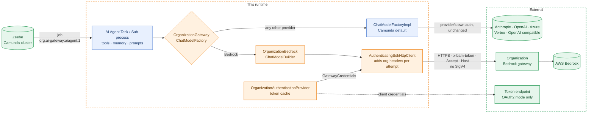
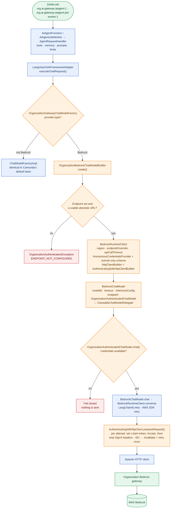
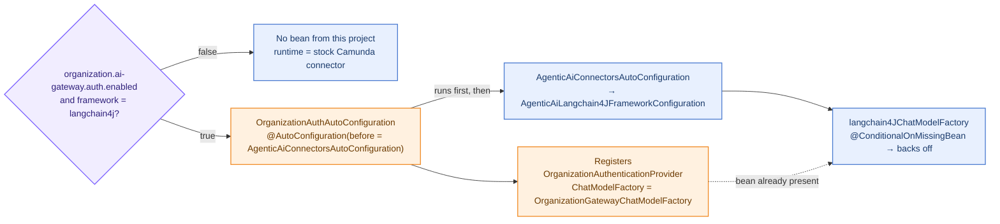
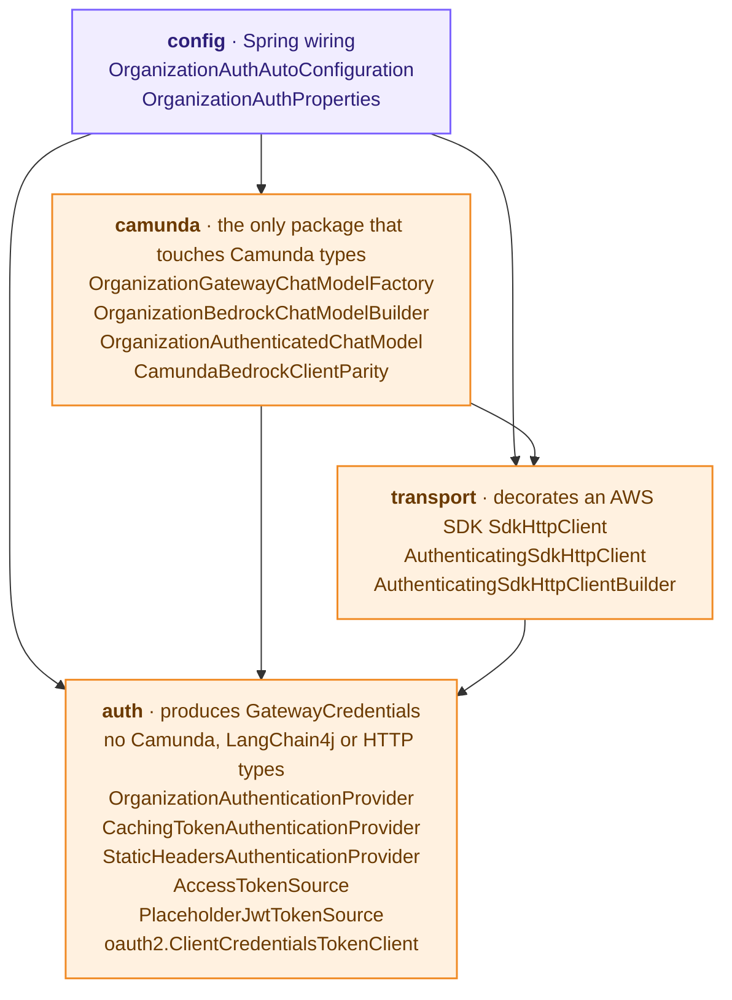
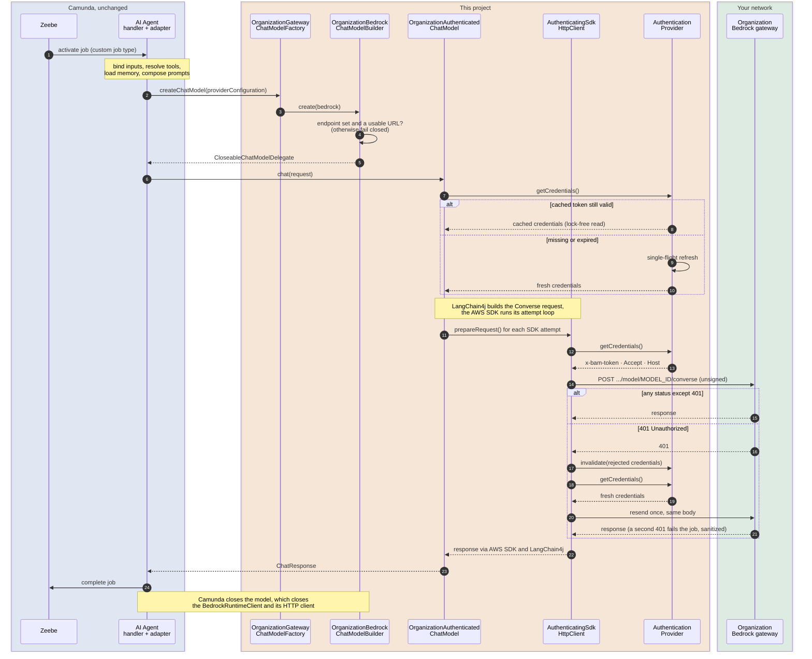

# Architecture: organization authentication for the AI Agent's Bedrock provider

This analysis is based on the **decompiled bytecode** of
`io.camunda.connector:connector-agentic-ai:8.9.12`, LangChain4j `langchain4j-bedrock` 1.18.1 and
AWS SDK v2 2.50.2, the versions `pom.xml` resolves. Every class and method named below exists in
those artifacts.

## At a glance



**Colours used in every diagram in these docs:**
🟦 Camunda / LangChain4j / AWS SDK code, unchanged ·
🟧 this project ·
🟩 external systems ·
🟥 fail-closed paths ·
🟪 configuration.

## 1. Feasibility

**Supported**, through a documented Camunda extension point: a `@ConditionalOnMissingBean` bean
override. There is no fork, no reflection and no AOP. Parts of Camunda's Bedrock client setup are
in private methods, so they are **reproduced** in one class, `CamundaBedrockClientParity`, and
re-checked on every upgrade (see [UPGRADING.md](UPGRADING.md)).

## 2. Facts that shaped the design

| # | Question | Answer (8.9.12) |
|---|---|---|
| 1 | Where is the Bedrock model created? | `ChatModelFactoryImpl#createBedrockChatModel(BedrockProviderConfiguration)` (protected). It calls the private `createBedrockClient`, `deriveTimeoutSetting` and `applyBedrockModelParametersIfPresent`, and returns `new CloseableChatModelDelegate(BedrockChatModel, BedrockRuntimeClient)`. |
| 2 | How is the client built? | `BedrockRuntimeClient.builder().region(Region.of(region))`, the authentication customizer, `endpointOverride(URI.create(endpoint))` if set, `apiCallTimeout(timeout)`, and `httpClientBuilder(proxySupport.createAwsHttpClientBuilder(uri).connectionTimeout(15s).socketTimeout(timeout))`. `createAwsHttpClientBuilder` and `createAwsProxyConfiguration` are **package-private**. |
| 3 | How is authentication chosen? | `AwsBedrockRuntimeAuthenticationCustomizer.createFor(connection)` switches over the **sealed** `AwsAuthentication` (`credentials`, `apiKey`, `defaultCredentialsChain`). A new type cannot be added without forking. API-key mode uses `AnonymousCredentialsProvider` + `putAuthScheme(NoAuthAuthScheme.create())` + a static `Authorization: Bearer` header. |
| 4 | Which hook runs on **every** HTTP attempt? | Not `ExecutionInterceptor.modifyHttpRequest`: `BaseClientHandler#finalizeSdkHttpFullRequest` calls it **once per execution**, before the retry pipeline. Signing runs per attempt, and so does `SdkHttpClient#prepareRequest` (`MakeHttpRequestStage`), which runs *after* signing. So the organization headers are added by an `SdkHttpClient` decorator, installed through `httpClientBuilder(...)` so that the SDK owns the client and closes it. |
| 5 | Which auth schemes does Bedrock resolve? | `DefaultBedrockRuntimeAuthSchemeProvider` offers `aws.auth#sigv4` and `smithy.api#httpBearerAuth`, **not** `noAuth`. We set `authSchemeProvider(...)` to resolve only `smithy.api#noAuth`, so neither SigV4 nor a bearer token (for example from `AWS_BEARER_TOKEN_BEDROCK`) can ever be applied. The decorator also strips `Authorization`/`X-Amz-Date`/`X-Amz-Security-Token`/`X-Amz-Content-Sha256` as defence in depth. |
| 6 | Can the `Host` header be set? | Yes. The Apache client's `ApacheHttpRequestFactory#getHostHeaderValue` uses a `Host` header from the request if one is present. |
| 7 | Retries? | LangChain4j `BedrockChatModel` retries 2 times (`maxRetries` default) through `BedrockExceptionMapper`. It maps 401 to a non-retriable `AuthenticationException`. The AWS SDK standard retry strategy does not retry 401/403. |
| 8 | Is `ChatModelFactory` replaceable? | Yes: `AgenticAiLangchain4JFrameworkConfiguration#langchain4JChatModelFactory` is `@Bean @ConditionalOnMissingBean`, imported by `AgenticAiConnectorsAutoConfiguration`. |
| 9 | Hybrid mode with Camunda SaaS? | Yes. The runtime is a normal job worker client. It must use **custom job types**, because the SaaS runtime polls the standard ones. Bedrock validation rejects `defaultCredentialsChain` only when `CAMUNDA_CONNECTOR_RUNTIME_SAAS` is set, which is not the case for a self-hosted runtime. |

### `CONNECTOR_AI_AGENT_TYPE` vs `CONNECTOR_AI_AGENT_JOB_WORKER_TYPE`

| Element | Camunda class | Default type | Override variable |
|---|---|---|---|
| **AI Agent Task** | `AiAgentFunction` (`@OutboundConnector`, name `AI Agent`) | `io.camunda.agenticai:aiagent:1` | `CONNECTOR_AI_AGENT_TYPE` |
| **AI Agent Sub-process** | `AiAgentJobWorker` (name `AI Agent Job Worker`) | `io.camunda.agenticai:aiagent-job-worker:1` | `CONNECTOR_AI_AGENT_JOB_WORKER_TYPE` |

## 3. Execution path



<details>
<summary>Plain-text version</summary>

```
Camunda job (org.ai-gateway:aiagent:1 or org.ai-gateway:aiagent-job-worker:1)
 → AiAgentFunction / AiAgentJobWorker → *AgentRequestHandler (tools, memory, prompts, limits)
 → Langchain4JAiFrameworkAdapter#executeChatRequest         (Camunda, unchanged)
 → ChatModelFactory#createChatModel     ◄── OrganizationGatewayChatModelFactory (bean override)
     ├─ not Bedrock → ChatModelFactoryImpl (identical to Camunda's default bean)
     └─ Bedrock     → OrganizationBedrockChatModelBuilder#create
           endpoint check (set, absolute URL with a host) ─ otherwise fail closed
           BedrockRuntimeClient: region, endpointOverride, apiCallTimeout,
             AnonymousCredentialsProvider + NoAuthAuthScheme + noAuth-only resolver,
             httpClientBuilder(AuthenticatingSdkHttpClientBuilder(Apache builder as Camunda))
           BedrockChatModel: client, modelId, timeout, inferenceConfig parameters
           → CloseableChatModelDelegate(OrganizationAuthenticatedChatModel, client)
 → OrganizationAuthenticatedChatModel#chat: credentials first (fail closed), then
   BedrockChatModel#chat (LangChain4j retry) → BedrockRuntimeClient#converse (SDK retry)
   → per attempt: AuthenticatingSdkHttpClient#prepareRequest
        OrganizationAuthenticationProvider#getCredentials,
        set x-bam-token / Accept / Host, strip SigV4 headers, 401 → invalidate + retry once
   → Apache HTTP client → Organization Bedrock gateway → Bedrock
```

</details>

## 4. Extension point

How the bean override happens at startup:



| What | Camunda type | Mechanism |
|---|---|---|
| **Overridden bean** | `ChatModelFactory` (`@ConditionalOnMissingBean`) | `OrganizationAuthAutoConfiguration` is `@AutoConfiguration(before = AgenticAiConnectorsAutoConfiguration.class)` and registers `OrganizationGatewayChatModelFactory`. `RuntimeApplicationSmokeIT` asserts exactly one bean. |
| **Reused unchanged** | `ChatModelFactoryImpl` (non-Bedrock providers), `CloseableChatModelDelegate`, `Langchain4JAiFrameworkAdapter`, all agent/tool/memory beans | constructed and used exactly as Camunda does |
| **Reproduced (private in Camunda)** | `createBedrockClient`, `deriveTimeoutSetting`, `applyBedrockModelParametersIfPresent`, `createAwsHttpClientBuilder`, `createAwsProxyConfiguration` | `CamundaBedrockClientParity`, using only public APIs (`AgenticAiHttpProxySupport#getProxyConfiguration`, `ProxyConfiguration#getProxyDetails`, `NonProxyHosts#getNonProxyHostRegexPatterns`) |
| **AWS SDK public API** | `BedrockRuntimeClientBuilder#httpClientBuilder`, `#authSchemeProvider`, `#putAuthScheme`, `SdkHttpClient` | `AuthenticatingSdkHttpClient(Builder)` |

Layering (arrows point from a package to the packages it depends on):



* `auth` knows nothing about Camunda, LangChain4j or HTTP. It only produces `GatewayCredentials`.
* `transport` knows nothing about Camunda. It decorates an AWS SDK `SdkHttpClient`.
* `camunda` is the only package that touches Camunda types.
* `config` does the Spring wiring.

## 5. Why this is safe

1. **One documented override.** Only the `ChatModelFactory` bean is replaced. Camunda's classes
   are not modified, subclassed or reflected on.
2. **Parity is tested, not assumed.** `OrganizationBedrockChatModelBuilderTest#requestBodyIsIdenticalToStandardConnector`
   sends the same element configuration through Camunda's own factory and through ours, and
   compares URI and body byte for byte. Region, endpoint, API call timeout (element value and
   default fallback) and parameter mapping are asserted separately.
3. **Every Bedrock call is organization-authenticated or fails.** A missing or unusable endpoint,
   a failing token source, or a gateway 401/403 fails the job with a sanitized
   `OrganizationAuthenticationException`. There is no fallback to AWS endpoints or to Camunda's
   built-in Bedrock authentication.
4. **The endpoint is whatever the element says.** There is no allow-list: organization credentials
   go to the URL configured on the element, so deploy rights on organization AI Agent elements are
   what limits where they can be sent.
5. **Off switch = stock Camunda.** With `organization.ai-gateway.auth.enabled=false` no bean from
   this project exists (`StandardBehaviourRegressionIT`).
6. **Error semantics preserved.** The adapter wraps model-call exceptions into
   `ConnectorException(FAILED_MODEL_CALL, "Model call failed: …")`. Ours travel the same path.

## 6. What happens during one AI Agent request



1. Zeebe activates a job of this runtime's custom type. Camunda binds the element inputs,
   resolves tools, loads memory and composes the prompts. None of this is changed.
2. `Langchain4JAiFrameworkAdapter` asks the `ChatModelFactory` bean for a model.
   `OrganizationGatewayChatModelFactory` sees `provider.type = bedrock`.
3. `OrganizationBedrockChatModelBuilder` checks the endpoint and builds the client and model as
   described above. AWS keys on the element are ignored, with a warning.
4. `OrganizationAuthenticatedChatModel#chat` gets the credentials first. A cached token is a
   lock-free read; an expired one triggers a single-flight refresh. If that fails, the job fails
   and nothing is sent.
5. LangChain4j builds the Converse request. On each SDK attempt, `AuthenticatingSdkHttpClient`
   sets `x-bam-token`, `Accept` and `Host`, and sends the request unsigned.
6. On **401**, it invalidates exactly that token, fetches a fresh one and resends once, with the
   same body. A second 401, or a 403, becomes a sanitized, non-retriable exception. Any other
   status is returned unchanged, so LangChain4j and Camunda handle it as in the standard connector.
7. After the job, Camunda closes the model, which closes the `BedrockRuntimeClient` and with it
   the HTTP client.
