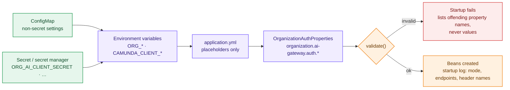
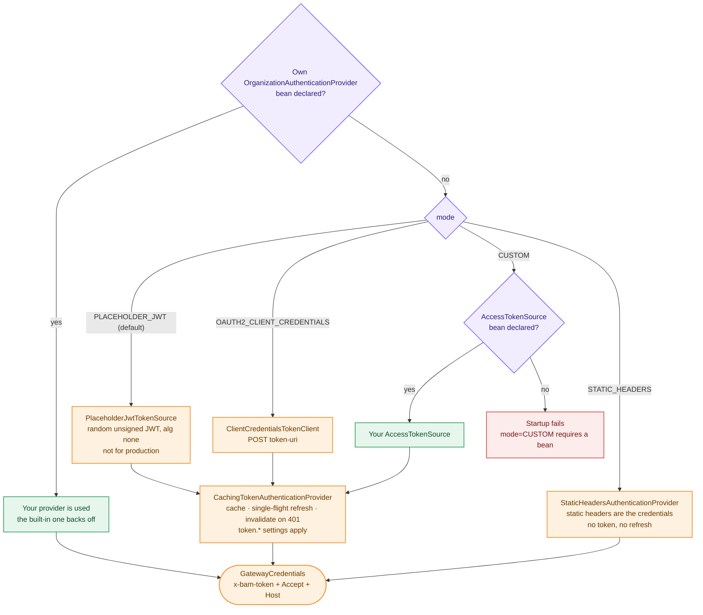
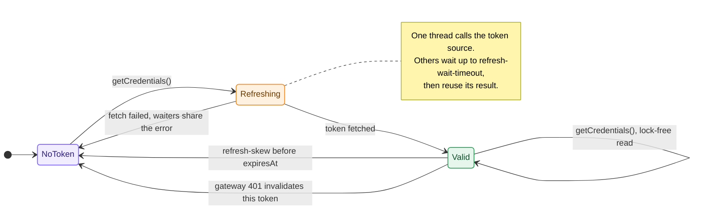
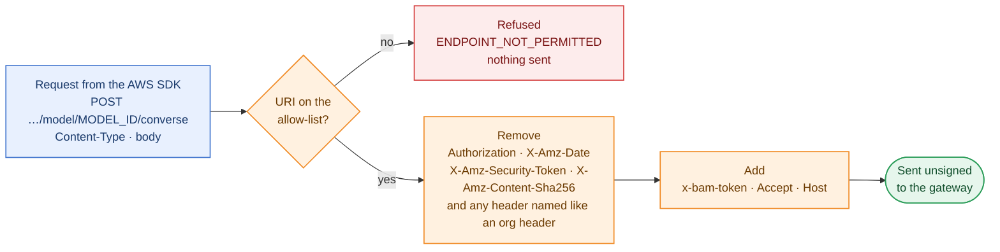
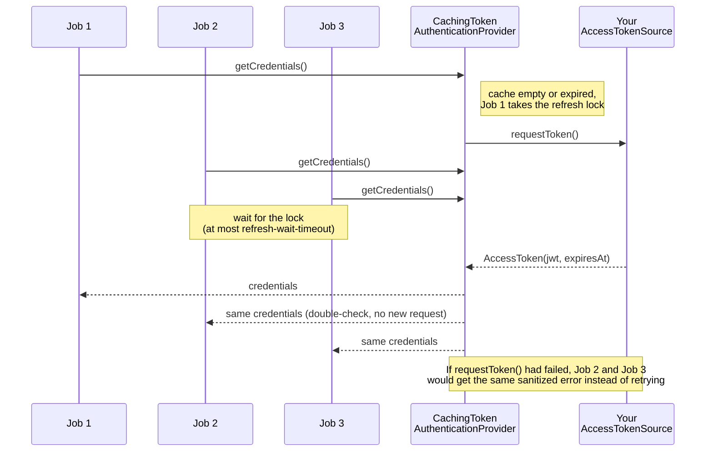

# Configuration reference

All settings live under `organization.ai-gateway.auth.*` (own namespace, so no clash with future
Camunda properties). `application.yml` maps them to `ORG_*` environment variables. Every secret
**must** come from the environment, typically a Kubernetes Secret or a secret-manager agent/CSI
driver. Nothing secret belongs in `application.yml`, in the image or in BPMN.



Colours: 🟦 Camunda, unchanged · 🟧 this project · 🟩 external · 🟥 fail closed · 🟪 configuration.

## Environment variables

### Camunda cluster (standard Camunda client, not specific to this project)

| Variable | SaaS (hybrid) | Self-Managed |
|---|---|---|
| `CAMUNDA_CLIENT_MODE` | `saas` | `self-managed` |
| `CAMUNDA_CLIENT_CLOUD_CLUSTERID` | cluster id | – |
| `CAMUNDA_CLIENT_CLOUD_REGION` | e.g. `bru-2` | – |
| `CAMUNDA_CLIENT_AUTH_CLIENTID` / `CAMUNDA_CLIENT_AUTH_CLIENTSECRET` | API client credentials (**secret**) | OIDC client credentials (**secret**) |
| `CAMUNDA_CLIENT_GRPCADDRESS` / `CAMUNDA_CLIENT_RESTADDRESS` | – | Zeebe gateway addresses |

Do **not** set `CAMUNDA_CONNECTOR_RUNTIME_SAAS` on this runtime. Camunda then rejects the
`defaultCredentialsChain` authentication that the organization templates use.

### Job types

| Variable | Default (`application.yml`) | Element |
|---|---|---|
| `ORG_AI_AGENT_TASK_TYPE` → `CONNECTOR_AI_AGENT_TYPE` | `org.ai-gateway:aiagent:1` | AI Agent **Task** |
| `ORG_AI_AGENT_SUBPROCESS_TYPE` → `CONNECTOR_AI_AGENT_JOB_WORKER_TYPE` | `org.ai-gateway:aiagent-job-worker:1` | AI Agent **Sub-process** |

### Organization Bedrock authentication

| Property | Env variable | Default | Description |
|---|---|---|---|
| `enabled` | `ORG_AI_GATEWAY_AUTH_ENABLED` | `true` (yml) / `false` (code) | Master switch. `false` = exactly the standard connector. With `true`, startup fails with a message naming `ORG_AI_GATEWAY_URL` if it is missing. |
| `allowed-endpoints` | `ORG_AI_GATEWAY_URL` | – (**required**) | Comma-separated Bedrock gateway base URLs. Every Bedrock AI Agent must use one as its custom endpoint (same scheme, host and port; path on a segment boundary). Anything else fails the job. |
| `mode` | `ORG_AI_GATEWAY_AUTH_MODE` | `PLACEHOLDER_JWT` | `PLACEHOLDER_JWT`, `OAUTH2_CLIENT_CREDENTIALS`, `STATIC_HEADERS` or `CUSTOM`. |
| `retry-on-unauthorized` | – | `true` | After a gateway 401, refresh the token and resend once. The token is invalidated either way. |
| `allow-insecure-http` | – | `false` | Permit `http://` gateway/token URLs. **Local development only.** |
| `static-headers[n].name` / `.value` | – | `Accept: application/json`, `Host: ${ORG_AI_GATEWAY_HOST_HEADER}` | Headers sent on every request next to the token. In `STATIC_HEADERS` mode they are the credentials. `Host` must be `host[:port]`, not a URL. |
| `static-headers[1].value` (Host) | `ORG_AI_GATEWAY_HOST_HEADER` | `bedrock-gateway.placeholder.invalid` (**placeholder**) | The `Host` header value the gateway expects. |

#### Which credentials each `mode` produces



#### `token.*` (all modes except `STATIC_HEADERS`)

| Property | Env variable | Default | Description |
|---|---|---|---|
| `header-name` | `ORG_AI_GATEWAY_TOKEN_HEADER` | `x-bam-token` | Header that carries the token. |
| `header-value-template` | `ORG_AI_GATEWAY_TOKEN_HEADER_TEMPLATE` | `{token}` | Value; `{token}` is replaced (e.g. `Bearer {token}`). |
| `refresh-skew` | – | `PT60S` | Treat the token as expired this long before it expires. Capped at half the lifetime. |
| `refresh-wait-timeout` | – | `PT15S` | Max wait for an in-flight refresh before failing with a transient error. |

The life of a cached token (one cache per pod):



The skew is capped at half the token's lifetime, so a short-lived token is never "expired on arrival".

#### `placeholder-jwt.*` (mode `PLACEHOLDER_JWT`)

| Property | Default | Description |
|---|---|---|
| `lifetime` | `PT5M` | `exp` of each generated JWT (`alg: none`, random `jti`). |

#### `oauth2.*` (mode `OAUTH2_CLIENT_CREDENTIALS`)

| Property | Env variable | Default | Description |
|---|---|---|---|
| `token-uri` | `ORG_AI_TOKEN_URL` | – (**required**) | OAuth 2.0 token endpoint. |
| `client-id` | `ORG_AI_CLIENT_ID` | – (**required**) | Client id. |
| `client-secret` | `ORG_AI_CLIENT_SECRET` | – (**required, secret**) | Client secret. |
| `scope` / `audience` | `ORG_AI_TOKEN_SCOPE` / `ORG_AI_TOKEN_AUDIENCE` | – | Optional. |
| `client-authentication` | `ORG_AI_TOKEN_CLIENT_AUTH` | `CLIENT_SECRET_BASIC` | Or `CLIENT_SECRET_POST`. |
| `additional-parameters.*` | – | – | Extra form parameters. |
| `connect-timeout` / `request-timeout` | – | `PT5S` / `PT10S` | Token endpoint timeouts. |
| `default-token-lifetime` | – | `PT5M` | Used when the response has no `expires_in`. |

## What goes on the wire

```
POST https://<gateway>/<base>/model/<model id, URL-encoded>/converse
x-bam-token: <token>
Accept: application/json
Host: <ORG_AI_GATEWAY_HOST_HEADER>
Content-Type: application/json
(no Authorization, X-Amz-Date, X-Amz-Security-Token or X-Amz-Content-Sha256)
```

How `AuthenticatingSdkHttpClient` turns the AWS SDK's request into that, on every attempt:



## Plugging in the organization JWT

The placeholder is meant to be replaced. Add a bean and set `ORG_AI_GATEWAY_AUTH_MODE=CUSTOM`:

```java
@Bean
AccessTokenSource organizationJwt(/* your dependencies */) {
  return () -> {
    String jwt = /* generate or fetch the JWT */;
    Instant expiresAt = /* its expiry */;
    return new AccessToken(jwt, expiresAt);
  };
}
```

The runtime caches the token until `refresh-skew` before `expiresAt`, refreshes it single-flight,
invalidates it after a gateway 401, and sends it as `x-bam-token`. Throw
`OrganizationAuthenticationException` for permanent failures and
`OrganizationAuthenticationUnavailableException` for transient ones. Any other exception becomes a
sanitized `TOKEN_SOURCE_FAILED`, and its message is never logged.

When many AI Agent jobs need a token at the same moment, your source is called **once**:



For a mechanism that is not a single token (for example per-request signing), register an
`OrganizationAuthenticationProvider` bean instead. The built-in one backs off.

## Proxy

The gateway client and the token endpoint client honour Camunda's proxy variables
(`CONNECTOR_HTTP_PROXY_*`, `CONNECTOR_HTTPS_PROXY_*`, `CONNECTOR_HTTP_NON_PROXY_HOSTS`), plus the
JVM `http(s).proxyHost` system properties for the gateway client (`useSystemPropertyValues(true)`,
as in Camunda's Bedrock client).

## TLS

Both clients use the JVM default truststore. If the gateway or the token endpoint uses an internal
CA, add it to the image's truststore (or set `-Djavax.net.ssl.trustStore=…`).

## Logging

Log lines from this project carry SLF4J key/value pairs (`gatewayHost`, `httpStatus`, `attempt`,
`tokenEndpoint`, `expiresAt`, …). In the default plain-text output they are appended to the
message (`… call succeeded gatewayHost="gw" httpStatus="200" durationMs="812"`);
`SPRING_PROFILES_ACTIVE=json-logs` gives ECS JSON with those pairs as fields.

| Level | What is logged |
|---|---|
| `INFO` | Startup: runtime/connectors version, AI Agent job types, mode, allowed endpoints, header *names*, the bean override. Per agent turn: model creation (host, path, region, model, timeout), every gateway HTTP exchange (method, path, status, duration, attempt, AWS request id), `Bedrock chat call completed` (model, finish reason, tool calls requested, input/output/total tokens, duration). Non-Bedrock providers routed to Camunda's factory. Token refreshed (expiry, lifetime, refresh count), missing `expires_in`, slow concurrent refresh waits. 401 retry and its outcome, invalidation, SDK aborts. |
| `WARN` | Placeholder token in use, Host header still the placeholder, org auth disabled, standard AI Agent job types in use, token request/refresh failures, gateway 5xx/429, network errors, final 401/403, `Bedrock chat call failed` (error type, reason, status, duration), rejected Bedrock endpoints (with the allow list), AWS keys on the element ignored, `allow-insecure-http` |
| `ERROR` | Credentials refused for a non-allow-listed URL at request time (should never happen) |
| `DEBUG` | `Calling organization Bedrock gateway` (host, path, header names, attempt), replaced header names, why a URL did not match the allow list (`hint`: host/scheme/port/path), applied model parameters, proxy selection, gateway 401/403 responses |
| `TRACE` | Cached-token hits |

At every level, the logs never contain tokens, client secrets, header values, element AWS keys,
or request/response bodies. `LoggingIT` asserts this at `TRACE`. Never enable DEBUG on
`org.apache.http.headers` or `org.apache.http.wire` in production: they log header values.
