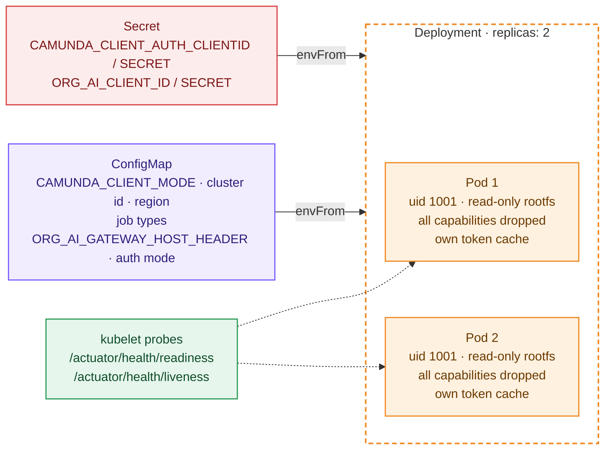
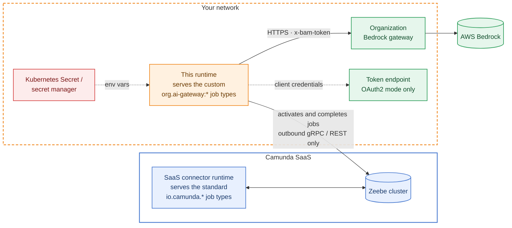
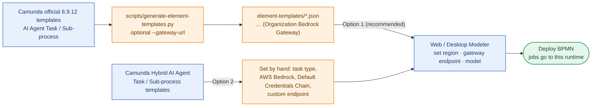

# Build, run and deploy

## Prerequisites

* JDK 21. Maven is not required: use the bundled wrapper `./mvnw`.
* A Camunda 8.9 cluster, either SaaS (hybrid mode) or Self-Managed.
* The organization Bedrock gateway URL and the `Host` value it expects. Until the organization
  token generation is plugged in, a placeholder JWT is sent (see [CONFIGURATION.md](CONFIGURATION.md#plugging-in-the-organization-jwt)).

## Build and test

```bash
./mvnw verify          # compiles, runs all unit + integration tests (no external services needed)
./mvnw package         # target/org-ai-agent-connector-runtime-1.0.0-SNAPSHOT.jar      thin jar for the Camunda connector runtime
                       # target/org-ai-agent-connector-runtime-1.0.0-SNAPSHOT-exec.jar standalone fat jar (java -jar / Docker)
```

## Run locally

```bash
export CAMUNDA_CLIENT_MODE=saas
export CAMUNDA_CLIENT_CLOUD_CLUSTERID=...  CAMUNDA_CLIENT_CLOUD_REGION=...
export CAMUNDA_CLIENT_AUTH_CLIENTID=...    CAMUNDA_CLIENT_AUTH_CLIENTSECRET=...

# The gateway URL itself is not a runtime variable: each AI Agent element carries it as its
# "Custom endpoint" and the runtime uses that URL as it is.
export ORG_AI_GATEWAY_HOST_HEADER=bedrock-gateway.internal.example
# default mode PLACEHOLDER_JWT; for OAuth2 instead:
# export ORG_AI_GATEWAY_AUTH_MODE=OAUTH2_CLIENT_CREDENTIALS ORG_AI_TOKEN_URL=… ORG_AI_CLIENT_ID=…
# export ORG_AI_CLIENT_SECRET=…            # from your secret store, never from a file in the repo

java -jar target/org-ai-agent-connector-runtime-1.0.0-SNAPSHOT-exec.jar
```

Startup validates the configuration. It fails fast with a list of the offending *property names*,
never their values. With the defaults in `application.yml`, the startup log shows:

```
Organization Bedrock gateway authentication enabled
PLACEHOLDER organization token in use: …   (until mode=CUSTOM with your AccessTokenSource)
```

## Docker

```bash
docker build -t org-ai-agent-connector-runtime:1.0.0 .
docker run --rm -p 8080:8080 --env-file runtime.env org-ai-agent-connector-runtime:1.0.0
```

`runtime.env` holds the variables above. Keep it out of version control (`.gitignore` covers
`*.env`). The image runs as uid 1001, contains no secrets, and uses Spring Boot's layered jar
layout.

## Kubernetes

`deploy/kubernetes/deployment.yaml` (ConfigMap and Deployment) and `secret.example.yaml`
(the shape of the Secret) are a starting point:



The Secret is drawn red because it holds the only sensitive values; nothing else in the picture does.

* Non-secret settings go in the ConfigMap. Credentials go in a Secret, injected with `envFrom`.
* Use a non-root user, a read-only root filesystem, and drop all capabilities.
* Readiness/liveness use `/actuator/health/*`. Readiness includes the Camunda client connection.
* Scale horizontally at will. Each pod keeps its own token cache, so N pods request at most N tokens
  per token lifetime.

## Hybrid mode (Camunda SaaS + this runtime)



Both runtimes talk to the same cluster, but they never compete for a job because they serve
different job types. The gateway credentials stay inside your network.

1. Create an API client in the SaaS console (scope *Zeebe*, plus *Secrets* if you use
   `{{secrets.*}}` in BPMN). Set `CAMUNDA_CLIENT_MODE=saas` and the cluster id, region and client
   credentials.
2. Keep the **custom job types** (defaults in `application.yml`). The SaaS connector runtime serves
   the standard `io.camunda.agenticai:*` types. If this runtime used them too, SaaS would pick up
   some of your AI Agent jobs, and those would call Bedrock without organization credentials
   (or be unable to reach the gateway).
3. `application.yml` disables the other agentic connectors (MCP remote client, A2A, ad-hoc tools
   schema) in this runtime, so it never competes for standard job types. Tools *inside* the
   ad-hoc sub-process (REST, MCP, …) keep running wherever they run today.
4. The outbound call to the Bedrock gateway originates from this runtime inside your network.
   Camunda SaaS never sees the gateway credentials.
5. Do not set `CAMUNDA_CONNECTOR_RUNTIME_SAAS` on this runtime (see CONFIGURATION.md).

## BPMN / Modeler

The only change a BPMN element needs is its **task definition type**. Pick one option.



### Option 1 (recommended): organization templates

`element-templates/org-bedrock-ai-agent-task.json` and
`element-templates/org-bedrock-ai-agent-subprocess.json` are **generated** from Camunda's official
8.9.12 templates by `scripts/generate-element-templates.py`. Compared with the official templates:

| Change | Why |
|---|---|
| new `id` / `name` (`… (Organization Bedrock Gateway)`) | never collides with Camunda's own template |
| task definition type = `org.ai-gateway:aiagent:1` / `org.ai-gateway:aiagent-job-worker:1` (hidden) | routes jobs to this runtime |
| `provider.type` fixed to `bedrock` (hidden), other providers' fields removed | this runtime customises Bedrock only |
| `provider.bedrock.authentication.type` fixed to `defaultCredentialsChain` (hidden); access key, secret key and API key fields removed | the runtime sends organization credentials; no AWS keys in BPMN |
| `provider.bedrock.endpoint` required, labelled *Organization Bedrock gateway endpoint* (optional default via `--gateway-url`) | the runtime rejects Bedrock calls to any other endpoint |

Everything else is Camunda's: region, model, max tokens, temperature, top P, timeout, prompts,
tools, memory, limits, events, response and retries.

Regenerate after changing job types or upgrading Camunda:

```bash
python3 scripts/generate-element-templates.py \
  --gateway-url https://bedrock-gateway.example.com/bedrock   # optional default endpoint in the template
```

Publish the two JSON files to your Web Modeler organization (*Create new → Upload files*) or copy
them into Desktop Modeler's `resources/element-templates`. In the element, set:

* **Region**: the AWS region of the model, e.g. `eu-central-1`
* **Organization Bedrock gateway endpoint**: the gateway URL. The runtime sends the organization
  credentials to exactly this URL, so it is the one place where the gateway is configured
* **Model**: the Bedrock model id, e.g. `anthropic.claude-3-5-sonnet-20240620-v1:0`
* optionally max tokens, temperature, top P and timeout

### Option 2 (zero custom templates): Camunda's hybrid templates

Camunda's *Hybrid AI Agent Task/Sub-process* templates expose **Task definition type**. Enter
`org.ai-gateway:aiagent:1` (or `…-job-worker:1`), choose *AWS Bedrock*, choose *Default
Credentials Chain* as authentication, and set the custom endpoint to the gateway URL. Any AWS keys
entered there are ignored by this runtime, but the fields stay visible.

### What never goes into BPMN

AWS keys, API keys, client secrets or tokens. The runtime adds the organization headers, and they
replace any same-named header.
