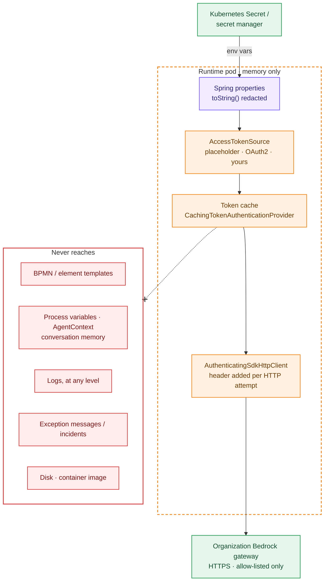
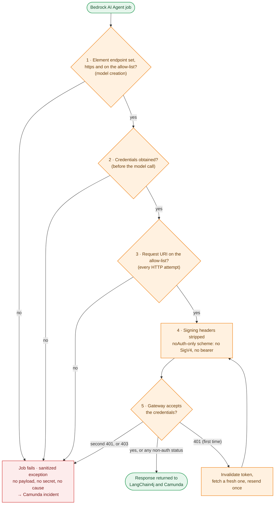
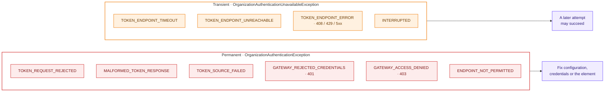

# Security review

## Secrets: where they live, and where they never live

| Secret | Source | Never in |
|---|---|---|
| Organization token (`x-bam-token`) | memory only (`CachingTokenAuthenticationProvider`, one per pod), from the `AccessTokenSource` | disk, process variables, agent context, logs, exception messages |
| OAuth2 client secret / static header values | env var → Spring property (`${ORG_AI_*}`), from a Kubernetes Secret or secret manager | `application.yml` values, image, BPMN, process variables, logs, exception messages, `toString()` |
| Camunda API client secret | env var (`CAMUNDA_CLIENT_AUTH_CLIENTSECRET`) | as above |

The token is added **below** LangChain4j and the AWS SDK's signing step, as a header on the
outgoing HTTP attempt. It never enters `AgentContext`, conversation memory or job variables.

**Placeholder token.** Until an `AccessTokenSource` bean is provided (`mode=CUSTOM`), the default
mode sends a random, unsigned JWT (`alg: none`). A warning is logged at startup. No gateway should
accept it: treat `PLACEHOLDER_JWT` as not production-ready.

## Controls

Every Bedrock call passes these checkpoints in order. Any "no" fails the job with a sanitized
exception. A failure at checkpoints 1–3 happens before anything is sent:

Failure reasons (`AuthenticationFailureReason`) and whether a later attempt can help:

| Threat | Control | Test |
|---|---|---|
| Modeler points the Bedrock endpoint at an attacker host to harvest organization tokens | Endpoint required and checked against the allow-list when the model is created, and again on the actual request URI of every attempt. Scheme, host and port must match exactly; the path must match on a segment boundary; `..` is normalized; user-info is rejected. | `GatewayEndpointMatcherTest`, `AuthenticatingSdkHttpClientTest#refusesNonGatewayTargets…`, `OrganizationBedrockChatModelBuilderTest#missingNonHttpsOrForeignEndpoints…` |
| Falling back to AWS or to Camunda's built-in Bedrock auth | Every Bedrock config goes to the organization path; element AWS keys/API key are ignored; the client resolves only the no-auth scheme | `OrganizationGatewayChatModelFactoryTest#everyBedrockConfiguration…`, `…#bedrockOutsideTheGatewayIsRejected…` |
| Unauthenticated call when the token cannot be obtained | Credentials are fetched before the model is called and on every attempt; failures throw, nothing is sent | `…#rejectedTokenRequestFailsClosed…`, `…#unavailableTokenEndpoint…`, `…#unexpectedTokenSourceError…`, `OrganizationBedrockAiAgentIT#identityProviderOutage…` |
| SigV4 or env bearer token leaking to the gateway | `authSchemeProvider` resolves only `smithy.api#noAuth`; `Authorization`/`X-Amz-*` signing headers stripped unless they are organization headers | `…#sendsOrganizationHeadersAndNoAwsSignature`, `AuthenticatingSdkHttpClientTest#…DropsAwsSigningHeaders` |
| Credentials sent in clear text | `https` required for the gateway (config and per element) and the token endpoint; `allow-insecure-http` exists for local dev only | `OrganizationAuthAutoConfigurationTest#invalidConfiguration…`, `…#missingNonHttps…` |
| Credentials follow a redirect | Token client uses `Redirect.NEVER`; the AWS SDK Apache client does not follow redirects | code review |
| Secrets in logs | Only names, hosts, paths, status codes and OAuth error *codes* are logged | `LoggingIT` (TRACE), `PlaceholderJwtTokenSourceTest`, `AuthenticatingSdkHttpClientTest` |
| Secrets in exception messages (these become Camunda incidents) | Fixed message templates; remote detail only if it is a short lowercase code; no cause attached; unexpected token-source exceptions replaced by `TOKEN_SOURCE_FAILED` | `GatewayCredentialsTest`, `CachingTokenAuthenticationProviderTest#unexpectedSourceException…` |
| Secrets via `toString()` / actuator `configprops` | Redacting `toString()` on every type that holds a secret; Spring Boot hides values by default | `…#propertiesToStringRedactsAllSecrets` |
| Token-refresh stampede / IdP lockout | Single-flight refresh, shared failure for waiters, bounded wait; a fetch failure is thrown before LangChain4j's retry loop | `CachingTokenAuthenticationProviderTest` |

## Operational guidance

* Replace `PLACEHOLDER_JWT` with the organization token source before production.
* Set `ORG_AI_GATEWAY_HOST_HEADER` to the real value; the default is a placeholder.
* Do not set DEBUG on `org.apache.http.headers`/`org.apache.http.wire` in production.
* Do not expose actuator endpoints beyond `health` publicly.
* Rotate `ORG_AI_CLIENT_SECRET` (OAuth2 mode) by updating the Secret and restarting the pods.
  Tokens are in memory only.
* Container: non-root uid 1001, read-only root filesystem, all capabilities dropped (see
  `deploy/kubernetes`).
