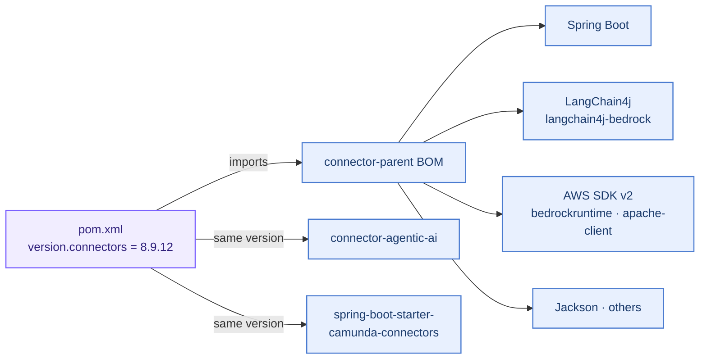
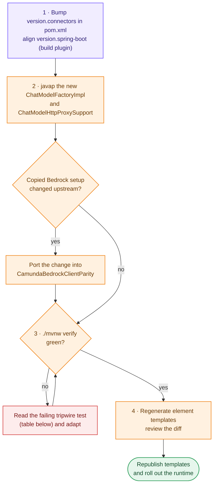

# Upgrading the Camunda connectors version

The only version this project pins is `<version.connectors>` in `pom.xml`. Spring Boot, LangChain4j,
the AWS SDK, Jackson and every other library come from Camunda's `connector-parent` BOM for that
version.



Colours: 🟦 Camunda / third-party, unchanged · 🟧 this project · 🟥 stop and fix · 🟪 configuration.

## Procedure



```bash
# 1. bump the version
sed -i '' 's|<version.connectors>.*<|<version.connectors>8.9.13<|' pom.xml   # example
#    also align <version.spring-boot> with connector-parent's <version.spring-boot> (build plugin only)

# 2. re-check the code copied from Camunda (see "Copied from Camunda" below)
J=~/.m2/repository/io/camunda/connector/connector-agentic-ai/<new>/connector-agentic-ai-<new>.jar
javap -c -p -classpath $J io.camunda.connector.agenticai.aiagent.framework.langchain4j.ChatModelFactoryImpl
javap -c -p -classpath $J io.camunda.connector.agenticai.aiagent.framework.langchain4j.ChatModelHttpProxySupport

# 3. run the full suite: it exercises the real Camunda, LangChain4j and AWS SDK classes end to end
./mvnw verify

# 4. regenerate the element templates, review the diff, republish
python3 scripts/generate-element-templates.py
```

## Copied from Camunda (re-check on every upgrade)

Camunda's Bedrock client setup is in private / package-private methods, so
`camunda/CamundaBedrockClientParity.java` reproduces it. Diff each item against the new version:

| Camunda 8.9.12 source | What was copied | Tripwire |
|---|---|---|
| `ChatModelFactoryImpl.CONNECT_TIMEOUT` | Apache `connectionTimeout` = 15 s | review only |
| `ChatModelFactoryImpl#deriveTimeoutSetting` | element timeout if `isPositive()`, else `aiagent.chatModel.api.defaultTimeout` | `OrganizationBedrockChatModelBuilderTest#regionEndpointAndElementTimeout…`, `#missingOrNonPositiveElementTimeout…` (asserted against our copy, so review the source) |
| `ChatModelFactoryImpl#createBedrockClient` | `Region.of(region)`, `endpointOverride(URI.create(endpoint))`, `apiCallTimeout(timeout)`, `socketTimeout(timeout)`, `httpClientBuilder(...)` | same, plus `#requestBodyIsIdenticalToStandardConnector` |
| `ChatModelFactoryImpl#createBedrockChatModel` | `BedrockChatModel.builder().client().modelId().timeout()`, `CloseableChatModelDelegate(model, client)` | `#requestBodyIsIdenticalToStandardConnector`, `#closingTheModel…` |
| `ChatModelFactoryImpl#applyBedrockModelParametersIfPresent` | maxTokens→`maxOutputTokens`, temperature, topP, each only if present | `#modelParametersAreSentAsInferenceConfig`, `#onlyPresentModelParametersAreSent`, `#requestBodyIsIdenticalToStandardConnector` (**fails if Camunda maps a new parameter**) |
| `ChatModelHttpProxySupport#createAwsHttpClientBuilder` | scheme from the endpoint, else `https` | review only |
| `ChatModelHttpProxySupport#createAwsProxyConfiguration` / `#toUri` | `useSystemPropertyValues(true)`, proxy `scheme`, `endpoint(scheme://host:port)`, `nonProxyHosts(NonProxyHosts.getNonProxyHostRegexPatterns())`, username/password | review only (no proxy test) |

If Camunda adds a new Bedrock setting (for example a new model parameter or a different client
option), our copy will not apply it until it is ported.

## Other integration points and their tripwires

| # | Assumption | Where used | What detects a change |
|---|---|---|---|
| 1 | `ChatModelFactory` bean is `@ConditionalOnMissingBean` in `AgenticAiLangchain4JFrameworkConfiguration`, imported by `AgenticAiConnectorsAutoConfiguration` | `OrganizationAuthAutoConfiguration` | `RuntimeApplicationSmokeIT`, `OrganizationBedrockAiAgentIT#camundaChatModelFactoryBeanIsReplaced…` |
| 2 | `ChatModelFactory#createChatModel(ProviderConfiguration)`, `ChatModelFactoryImpl(properties, ChatModelHttpProxySupport)`, `CloseableChatModelDelegate(ChatModel, AutoCloseable)` | router, auto-configuration, builder | compile error |
| 3 | `BedrockProviderConfiguration` / `BedrockConnection(region, endpoint, authentication, timeouts, model)` / `BedrockModelParameters(maxTokens, temperature, topP)` record shapes; `AwsDefaultCredentialsChainAuthentication` exists | builder, templates | compile error, generator exits |
| 4 | `AgenticAiHttpProxySupport#getProxyConfiguration`, `ProxyConfiguration#getProxyDetails`, `NonProxyHosts#getNonProxyHostRegexPatterns` are public | parity class | compile error |
| 5 | AWS SDK: `SdkHttpClient#prepareRequest` runs per attempt after signing; `httpClientBuilder` clients are closed with the service client; `authSchemeProvider`/`putAuthScheme(NoAuthAuthScheme)`; Apache honours a request `Host` header | transport, builder | `OrganizationBedrockChatModelBuilderTest` (headers, no SigV4, 401 retry, close), `AuthenticatingSdkHttpClientTest#hostHeaderCanBeOverridden` |
| 6 | LangChain4j `BedrockChatModel`: 401 → non-retriable; `NonRetriableException` not retried | error semantics | `#persistentUnauthorized…` (expects exactly 2 calls), `OrganizationBedrockAiAgentIT` |
| 7 | `Langchain4JAiFrameworkAdapter` wraps model failures as `ConnectorException(FAILED_MODEL_CALL, "Model call failed: …")` | error semantics | `OrganizationBedrockAiAgentIT` |
| 8 | Bedrock validation `isDefaultCredentialsChainUsedInSaaS` only checks `CAMUNDA_CONNECTOR_RUNTIME_SAAS` | templates fix `defaultCredentialsChain` | `OrganizationBedrockAiAgentIT` (binds a `defaultCredentialsChain` element) |
| 9 | Worker type overrides `CONNECTOR_AI_AGENT_TYPE` / `CONNECTOR_AI_AGENT_JOB_WORKER_TYPE` | `application.yml` | `RuntimeApplicationSmokeIT` |
| 10 | Official templates contain the task type, `provider.type` with `bedrock`, `provider.bedrock.authentication.type` with `defaultCredentialsChain`, `provider.bedrock.endpoint` | generator | the script exits with an error |
| 11 | `spring-boot-starter-camunda-connectors` ships `logback-spring.xml` (shadowed here) | `logback-spring.xml` | review manually |

## If Camunda adds native support

If a future release lets you customise Bedrock authentication or the Bedrock HTTP client
officially, prefer that and delete `…aiagent.camunda`. `auth` (including your `AccessTokenSource`)
and `transport` are reusable as they are.
